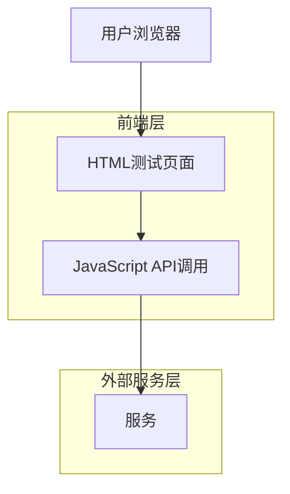

#  声音克隆测试页面 - 技术架构文档

## 1. 架构设计



## 2. 技术描述

- **前端**: HTML5 + CSS3 + JavaScript (ES6+)
- **UI框架**: 纯CSS自定义样式，响应式设计
- **API通信**: Fetch API (原生JavaScript)
- **文件处理**: HTML5 File API
- **音频播放**: HTML5 Audio元素

## 3. 核心功能模块

### 3.1 密钥配置模块
- App ID和Secret Key输入验证
- Access Token获取和存储
- Token有效期管理

### 3.2 声音克隆模块
- 音频文件上传和验证
- 文件格式检查 (MP3, WAV, M4A)
- 文件大小限制 (100MB)
- 声音克隆任务创建
- 任务状态轮询

### 3.3 声音列表管理
- 克隆声音列表获取
- 声音状态显示（制作中/已完成/失败）
- 进度条显示
- 音频预览播放

### 3.4 语音合成模块
- 文本输入和验证
- 语速和语调调节
- 语音合成任务创建
- 任务状态轮询
- 音频播放和字幕显示

## 4. API接口调用流程

### 4.1 获取Access Token
```
POST https://open-api.chanjing.cc/open/v1/access_token
Content-Type: application/json; charset=utf-8

{
    "app_id": "your_app_id",
    "secret_key": "your_secret_key"
}
```

### 4.2 创建声音克隆任务
```
POST https://open-api.chanjing.cc/open/v1/create_customised_audio
access_token: {{access_token}}
Content-Type: application/json

{
    "name": "声音名称",
    "url": "音频文件URL",
    "model_type": "cicada1.0",
    "language": "cn",
    "text": "预览文案（可选）"
}
```

### 4.3 获取声音列表
```
POST https://open-api.chanjing.cc/open/v1/list_customised_audio
access_token: {{access_token}}
Content-Type: application/json

{
    "page": 1,
    "page_size": 20
}
```

### 4.4 创建语音合成任务
```
POST https://open-api.chanjing.cc/open/v1/create_audio_task
access_token: {{access_token}}
Content-Type: application/json

{
    "audio_man": "声音ID",
    "speed": 1.0,
    "pitch": 1.0,
    "text": {
        "text": "要合成的文本",
        "plain_text": "要合成的文本"
    }
}
```

## 5. 状态管理

### 5.1 声音克隆状态
- 1: 制作中
- 2: 已完成
- 3: 已过期
- 4: 制作失败

### 5.2 语音合成状态
- 0: 等待中
- 1: 处理中
- 9: 已完成
- 8: 已失败

## 6. 错误处理

### 6.1 网络错误
- 显示友好的错误提示
- 提供重试机制
- 超时处理

### 6.2 API错误
- 解析错误代码和消息
- 显示具体的错误信息
- 提供解决建议

### 6.3 文件验证错误
- 格式检查
- 大小限制检查
- 实时反馈

## 7. 性能优化

### 7.1 轮询优化
- 合理的轮询间隔（5秒）
- 最大轮询次数限制
- 智能停止机制

### 7.2 用户体验优化
- 加载状态显示
- 进度条实时更新
- 操作反馈及时

### 7.3 本地存储
- Access Token本地缓存
- 减少重复输入
- 自动恢复会话

## 8. 安全考虑

### 8.1 API密钥管理
- 客户端存储风险提示
- 建议添加代理服务器
- 生产环境安全建议

### 8.2 文件上传安全
- 文件类型验证
- 文件大小限制
- 内容安全检查

## 9. 部署建议

### 9.1 开发环境
- 直接打开HTML文件即可使用
- 需要网络连接访问API
- 支持现代浏览器

### 9.2 生产环境改进
- 添加后端代理服务器
- 实现安全的文件上传
- 添加用户认证系统
- 实现API限流和缓存

## 10. 扩展功能建议

### 10.1 增强功能
- 批量任务处理
- 任务队列管理
- 历史记录保存
- 导出功能

### 10.2 用户界面优化
- 拖拽上传
- 实时预览
- 主题切换
- 多语言支持

## 11. 使用说明

### 11.1 快速开始
1. 在密钥配置区域输入App ID和Secret Key
2. 点击"获取Access Token"
3. 上传音频文件进行声音克隆
4. 等待克隆完成后选择声音
5. 输入文本进行语音合成

### 11.2 注意事项
- 音频文件格式支持MP3、WAV、M4A
- 音频时长需在30秒到5分钟之间
- 文本长度不能超过4000字
- API有QPS限制，请合理使用